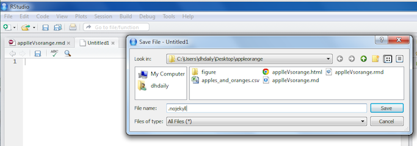

This is an example of turning a .html file generated from an Rmarkdown into a website powered by GitHub.

For a starting point let's assume we have a repo on GitHub with all our project files in it. 


In particular regardless of whatever other files are part of the repo, we have the finished .html version made by knitting the Rmarkdown to HTML. To turn it into a website, we have to do 3 things:

* make a .nojekyll file and make it part of the repo
* make a web-branch of the repo
* add a copy of our repo to the web branch

__Make a .nojekyll file__

We need to create an empty file called .nojekyll in our project folder. This can be quite challenging as .files are often invisible system files that the computer does not want you tampering with. While there are different ways of doing this on various kinds of computers, we are going to use a tool everyone has on hand by using RStudio itself.

From the __File__ menu, select __New File__ -> __Text File__ then immediately use the __File__ -> __Save__ command to save the file with the name .nojekyll



Then close the file so you don't accidentally put stuff in it.

Now we do our typical updating the repo commands to add the file to GitHub, something like:

```
git add .nojekyll
git commit -m ".nojekyll created"
git push -u origin master
```

We are being fairly specific about the git add command since some systems will want to leave the .nojekyll alone

__Make a web branch__

Still using git commands, we set up a web branch with

```
git branch gh-pages
```

__Copy our repo to the web branch__

With one more command, we copy the files into the web branch

```
git push origin gh-pages
```

Then we wait for a very long ten minutes, and check our page at http://USERNAME.github.io/REPONAME/HTMLFILENAME

